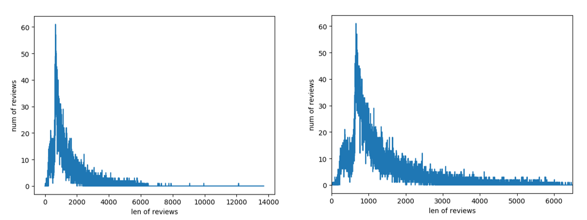
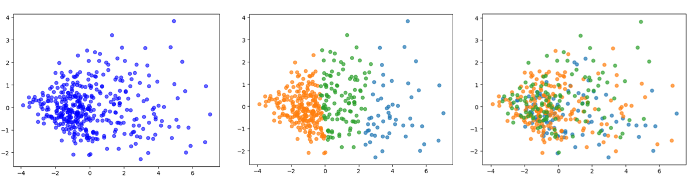

- 中文短评 $\Rightarrow$ IMDb

### 根据短评生成向量
- 难点：构建合适的模型，体现数据特征
- 我们的方法：
  - 预处理：小写、代替非单词

  - nltk.stem.porter.PorterStemmer()提取词干，生成短评词干列表
  - 利用词典，生成长度为词典长度的向量——{0,1}.


### 利用SVM二分类实现三分类
- 可用方法
  - "一对多" 法
  - "一对一" 法

- 具体实现
  - 广义二分类模型
  - 三分类svm类
    - 定义fit
    - 定义predict
  - 投票机制

- 别的方法
  - PCA + KMeans
  - BOW + TFIDF

- 结果
  - 模型一 + SVM
    - 训练误差在0.25-0.5间不等，但泛化误差基本保持在0.5上下，除了kernel = 'linear'时训练误差均降低到了0.3左右.

  - PCA + KMeans
  ```
  n_components=4,n_clusters = 3,score=0.0013026194177818155
  n_components=3,n_clusters = 3,score=0.0013625011682164075
  n_components=2,n_clusters = 3,score=0.0012008551333946745
  ```
  
  - BOW + TFIDF
    - 0.49233333333333335

  ||precision  |  recall|  f1-score |  support|
  |--|--|--|--|--|
  |        pos     |  0.00  |    0.00     | 0.00  |     764|
   |     unsup    |   1.00   |   0.00    | 0.00  |     714|
    |      neg   |    0.51    |  1.00   |   0.67   |   1522|
  |avg / total     |  0.50   |   0.51    |  0.34   |   3000|
  
- 比较分析
  - 模型一
    - 特征：包含相同词干的短评靠得更近
    - 缺陷：不考虑语义以及上下文，忽略不同词的权重
    - 在投票决定预测值时若A=B=C=1, 总是将结果预测为-1.
    - 词向量库相对较小. 只有1899个词，在判断评论情感倾向方面或许还有所欠缺.
    - 误差值相等，可以合理推测，其误差值已达到极限，即最小值，无法再获得提升
 
  - 模型二
    - 不考虑语义和上下文，丢失一部分语义
    - 出现更频繁的词语

  - 结合我们采用的转化词向量的两种方法.

- 我们的思考
  - 有时最传统的朴素贝叶斯分类器甚至比深度学习方法比如 CNN、LSTM、MLP 效果要好，SVM有时会超过朴素贝叶斯分类器.
  - 机器学习方法万千，具体选择用什么样的方法还是要取决于数据集的规模以及问题本身的复杂度，对于复杂程度一般的问题，看似简单的方法有可能是坠吼地.


