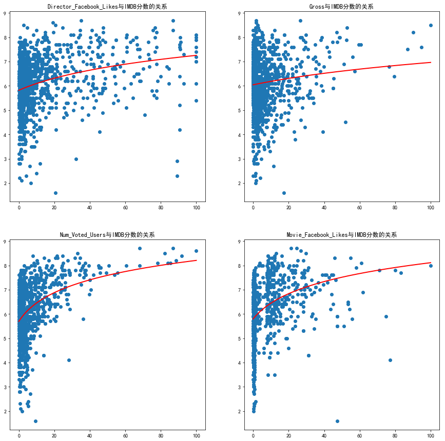

## 问题二
- 预测方法的探索
  - 难点：用于预测的属性的选择
  - 初次选定的属性: "电影为彩色还是黑白"、"电影时长”、"电影的总收入"、"IMDB投票用户数"、"电影的Facebook总关注度"
  - 难点: 数据分布不完全符合简单的线性回归

- 使用拟合过的数据进行线性回归


- 模型一的结果
  - 在某一次计算中得出的误差为：
  ```
  训练误差 0.97978742527
  测试误差 0.751153797185
  训练集准确率： 0.7175757575757575
  测试集准确率： 0.7681159420289855

  缺点：数据不易获得，不user-friendly
  ```
- 模型二
  - 第二次选定的属性（这是用户经常能想到和获得的属性）: "导演"、"主角"、"配角"、"流派"、"电影时长"

  - 难点：将导演等信息数值化

  - 做法：选择直接将训练集内该特性的所有作品的平均分作为每一特性的分数.

- 模型二的结果
  - 第二种模型在某次计算结果的误差如下：
  ```
  训练误差为： 0.172658212988
  泛化误差为： 0.797140418298
  训练集准确率： 0.9679307711885976
  测试集准确率： 0.7851851851851852

  缺点：选取的信息中有一些与事实每一部作品的得分的关系分布并不完全呈线性关系
  ```
- 两个模型的比较和分析
  - 第二个模型中看似简单粗暴的方法比之前看似科学的方法得出的结果好像要更好一些，而且操作起来也更简单，猜想原因如下：
    - 在评价一部电影的好坏时应该考察这部电影的导演、演员的水平，而不是简单地选取数值类型
    - 模型一中的数值类型的性质实际上与得分关系并不很大，或者说其分布并不理想，随机性过大故产生较大偏差.
    - 第一种模型的样本量较少

  - 最后，如果我们真的要做出一个应用来供用户使用的话，必须将交互性考虑进去，要适应用户的使用习惯.

- 分析与改进的方向
  - 分析
    - 泛化误差都不是非常理想，以如果有第一个模型所需要的数据的话也可以使用第一个模型进行预测
    - 结果的不理想一方面说明了这方面的能力仍需提高，另一方面也说明了电影的好坏极具主观性与不确定性，不是单靠冰冷的数字或普遍的经验就能预测出来的.

  - 可能的改进方向：更换模型（如深度学习）

- 根据特定的流派（类型）进行推荐
  - 利用与之前模型二中相似的方法，根据用户的输入，获取特定流派（类型）中评分最高的电影.
  - 再在评分最高的30部电影中随机抽取5部作为推荐.
  - 最后从IMDB官网上爬取这五部电影的海报，存放在文件夹中，并打印出来.


