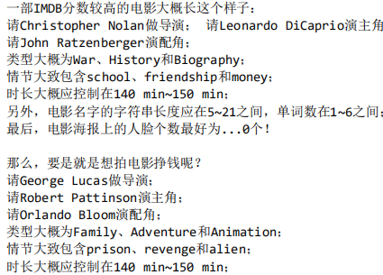
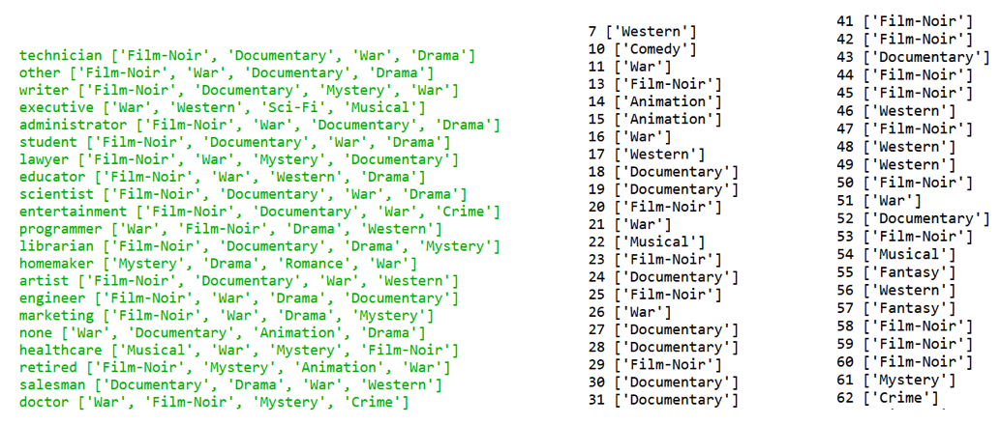

## 问题三
- 筛选最佳电影
  - 分析最受欢迎的电影与导演、主角、配角、类型、情节、时长、海报等因素的关系，给影片制作人提出建议.
  - 主要采用字典、数据筛选方法
  - 问题：数据集中，有些导演、主角、配角出演的电影少，有些类型的电影比较少，为了分析结果更加准确，设置相应的阀域

- 与用户相关的电影类型筛选
  - 分析不同性别、年龄、职业的人与他们喜欢的电影类别的关系，为他们推荐适合他们的电影
  - 主要采用数据透视的方法
  - 问题：有许多电影被归在多个类别下，所以将它们展开，比如一个电影有三个所属类别，那就将它与三个类别的组合都放到数据集中
  - 根据分析结果，可以看出，许多职业的人最喜欢的电影是一样的，为了更加准确，于是可从他们最喜欢的前四个类型的电影中随机抽取
