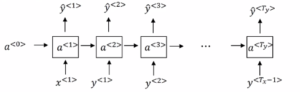

# Recurrent Neural Networks
## 数学符号
- $T_x, T_y$ 表示输入与输出序列的长度
  
- $x^{(i)<t>}, y^{(I)<t>}$ 表示第i个输入，输出序列中的第t个
- $x^{<t>}$是一个长度与词典长度相同的one-hot向量

## 前向传播 Forward propagation
- $a^{<0>} = \vec{0}$
  
- $a^{<t>} = g(W_{aa}a^{<y-1>}+W_{ax}x^<t>+b_a)$
- 可以简写为$a^{<t>} = g(W_a[a^{<t-1>},x^{<t>}]+b_a)$, 其中$W_a = [W_{aa}|W_{ax}], [a^{<t-1>},x^{<t>}]$ 是竖过来写的.
- $\hat{y}^{<t>} = g(W_{ya}a^{<y-1>}+b_y)$

## 反向传播 Backpropagation
- 计算损失函数 ${\Bbb{L}}^{<t>}(\hat{y}^{<t>}, y^{<t>})=-y^{<t>}\log{\hat{y}^{<t>}}-(1-y^{<t>})\log(1-\hat{y}^{<t>})$
  
- ${\Bbb{L}}(\hat{y}, y) = \displaystyle\sum\limits_{t=1}^{T_y}{\Bbb{L}}^{<t>}(\hat{y}^{<t>}, y^{<t>})$
- Also called Backpropagation through time

## Language modelling with an RNN
- 句尾加$<EOS>$, 未事先标记的特殊单词记为$<UNK>$

- $激活项a^{<0>}=\vec{0} \rightarrow a^{<1>}输入x^{<1>}，经过softmax计算第一个词的概率，输出y^{<1>}，作为x^{<2>}...$
- $P(sentence)=P(y^{<1>},y^{<2>},...,y^{<t_y>})$
- $P(y^{<1>},y^{<2>},y^{<3>}) = P(y^{<1>})*P(y^{<2>}|y^{<1>})*P(y^{<3>}|y^{<1>,y^{<2>}})$

## Sampling novel sequences
- 用一个训练好的RNN对新序列进行采样

- $输入激活项a^{<0>}=\vec{0}，x^{<1>}=0，输出的所有可能的结果是经过softmax层后得到的不同的词的概率，然后根据这个概率分布进行随机采样，用np.random.choice. 将刚刚采样好的y^{<1>}作为x^{<2>}输入，再对输出进行采样，得到x^{<2>}$
- 何时结束抽样：如果字典里有$<EOS>$，则一直抽到其出现；若没有，则抽到设定的时间步. 可以设置拒绝采样$<UNK>$
- 建立基于字符的语言模型(不利于捕捉长范围的关系，长期依赖效应)

## 梯度消失 Vanishing gradients with RNNs and solutions
- 如果是很深的神经网络，输出$y$得到的梯度很难传播回去，影响靠前层的权重；后面层的输出误差很难影响前面层的计算

- 例如很难长时间记住前面的名词是单数还是复数
- 梯度爆炸：在反向传播过程中梯度呈指数型上升/下降——梯度修剪：观察梯度向量，如果大于某个阈值，就缩放梯度向量，确保不会太大
- 但是梯度消失更难处理