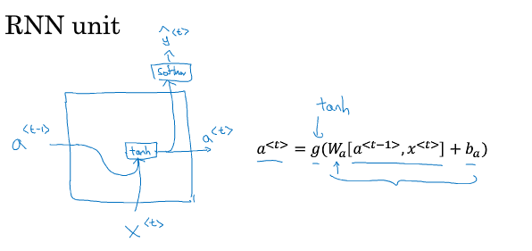

# Gated Recurrent Unit

$a^{<t>} = g(W_a[a^{<t-1>},x^{<t>}+b_a])$
## GRU(simplified)
- $c = memory cell$

- $c^{<t>} = a^{<t>}$，在GRU中，这两个值相同，在LSTM中，这两个值不同
- 用一个候选值 $\widetilde{c}^{<t>} = \tanh(W_c[c^{<t-1>},x^{<t>}]+b_c)$ 重写记忆细胞
- GRU真正重要的思想是有一个门 $\Gamma_u$ (u代表更新门update)，它是一个 0 到 1 间的值，$\Gamma_u = \sigma(W_u[c^{<t-1>},x^{<t>}]+b_u)$ (由于sigmoid函数的缘故，$\Gamma_u$的值总是很接近 0 和 1 )
- 对于计算出的用于更新 ${c}^{<t>}的\widetilde{c}^{<t>}$, $\Gamma_u$ 决定是否要更新它.
  - The cat, which already ate ..., was full.
  - The cats, which already ate ..., were full.
  
  ${c}^{<t>}$会根据句子中的单词是单数还是复数被设置为 0 或 1，而$\Gamma_u$ 用于决定何时来更新这个值. 例如，在cat处，${c}^{<t>}$被设为 1, GRU 单元会一直记住${c}^{<t>}$的值，直到决定用 was 还是 were. 
- 参数更新：
$$
\begin{aligned}
  \widetilde{c}^{<t>} &= \tanh(W_c[\Gamma_r*c^{<t-1>},x^{<t>}]+b_c)\\

  \Gamma_u &= \sigma(W_u[c^{<t-1>},x^{<t>}]+b_u)\\

  \Gamma_r &= \sigma(W_r[c^{<t-1>},x^{<t>}]+b_r\\

  {c}^{<t>} &= \Gamma_u*\widetilde{c}^{<t>}+(1-\Gamma_u)*c^{<t>}\\

\end{aligned}
$$

