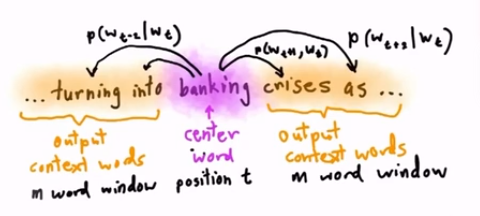
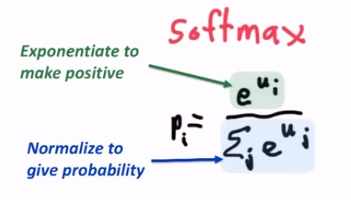
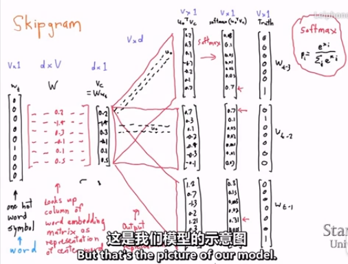
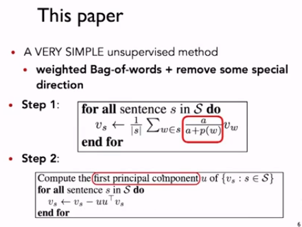
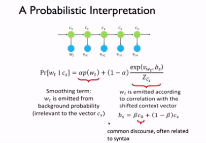

## Word meaning
- WordNet——has hypernyms relationships and synonyms sets
- Problems with this discrate representation
  - Subjective
  - New words
  - ...
  - The vast majority of rule-based and statistic NLP work regards words as atomic symbols: one-hot representation / a localist representation

- From symbolic to distributed representation
  - Our query and document vectors are orthogonal
  - There is no natural notion of similarity in a set of one-hot vectors
  - Could deal with similarity seperately
  - instead we explor a direct approach where vectors encode it

- Distributional similarity based representation
  - "You shall know a word by the company it keeps."

- Basic idea of learning neural network word embeddings
  - We define a model that aims to predict between a center word $w_t$ and context words in terms of word vectors
  $$p(context|w_t) = ...$$
  - which has a loss function ($w_{-t}表示除$w_t$外所有其他上下文), e.g.,
  $$J = 1-p(w_{-t}|w_t)$$
  - keep adjusting the vector representations of words to minimize this loss

## Word2vec introduction
- Main idea —— Predict between every word and its context words
- Two algorithms
  1. Skip-grams(SG)
    
  2. Continuous Bag of Words(CBOW)

- Two (moderately efficient) training methods
  1. Hierarchical softmax
  2. Negative sampling

### Details of Word2vec
  - For each word $t=1 ...T$, predict surrounding words in a window of "radius" $m$ of every word
  - Objective function: Maximize the probability of any context word given the current center word:
  $$
  \begin{aligned}
      J'(\theta) &= \displaystyle\sum_{t=1}^{T}\sum_{-m\leq j\leq m}p(w_{t+j}|w_t;\theta)\\
      J(\theta) &= \displaystyle-\frac{1}{T}\sum_{t=1}^{T}\sum_{-m\leq j\leq m}\log p(w_{t+j}|w_t)\\
  \end{aligned}
  $$
  - - $\theta$ represent all variables we will optimize, $J(\theta)$ is the negative log likelihood function we need to minimize as our objective function.
  - For $p(w_{t+j}|w_t)$ the simplest first formulation is     
      $$\displaystyle p(o|c) = \frac{exp(u_o^TV_c)}{\sum_{w=1}^Vexp(u_w^TV_c)}$$
      
      where $o$ is the outside (or output) word index, $c$ is the center word index, $V_c$ and $u_o$ are "center" and "outside" vectors of indices $c$ and $o$

      And! We have two vectors for each word
      
      Softmax: using word $c$ to obtain probability of word $o$

### Softmax function: Standard map from ${\Bbb R}^V$ to a probability distribution
  

### Picture of Skipgram model
  

### To train the model: Compute all vector gradients!
  
Note: Every word has two vectors! Makes it simpler!

## Reaserch highlight
### Sentence embedding
- Compute sentence similarity using inner product
- Use as features for sentence classification 
  
  

## Word2vec objective function gradients
$$
\frac{\partial}{\partial V_c}\log\frac{exp(u_o^TV_c)}{\sum_{w=1}^Vexp(u_w^TV_c)}
= \frac{\partial}{\partial V_c}\log exp(u_o^TV_c)(1)-\frac{\partial}{\partial V_c}\log\sum_{w=1}^Vexp(u_w^TV_c)(2)\\
$$
$$
\frac{\partial}{\partial (V_c)_k}\sum_{l=1}^{d}(u_o)_l(V_c)_l = (u_o)_k\\
\Rightarrow\frac{\partial}{\partial V_c}\log exp(u_o^TV_c) = \frac{\partial}{\partial V_c}u_o^TV_c = u_o\tag{1}
$$
Using the chain rule:
$$
\frac{\partial}{\partial V_c}\log\sum_{w=1}^Vexp(u_w^TV_c)
= \frac{1}{\sum_{w=1}^Vexp(u_w^TV_c)}\frac{\partial}{\partial V_c}\sum_{x=1}^Vexp(u_x^TV_c)\\
= \frac{1}{\sum_{w=1}^Vexp(u_w^TV_c)}\left[\sum_{x=1}^V\frac{\partial}{\partial V_c}exp(u_x^TV_c)\right]\\
= \frac{1}{\sum_{w=1}^Vexp(u_w^TV_c)}\left[\sum_{x=1}^Vexp(u_x^TV_c)\frac{\partial}{\partial V_c}(u_x^TV_c)\right]\\
= \frac{1}{\sum_{w=1}^Vexp(u_w^TV_c)}\left[\sum_{x=1}^Vexp(u_x^TV_c)u_x\right]\\
= \sum_{x=1}^V\frac{exp(u_x^TV_c)}{\sum_{w=1}^Vexp(u_w^TV_c)}u_x = \sum_{x=1}^Vp(x|c)u_x
\tag{2}
$$
$\Rightarrow$
$$
\frac{\partial}{\partial V_c}\log\frac{exp(u_o^TV_c)}{\sum_{w=1}^Vexp(u_w^TV_c)} = u_o(observed)-\sum_{x=1}^Vp(x|c)u_x(expectation)
$$

## Optimization refresher
- Cost/Objective functionsminimize $\rightarrow$ gradient descent
- Gradient Descent
  - To minimize $J(\theta)$ over the full batch (the entire training data) would require us to compute gradients for all windows
  - Updates would be for each element of $\theta$:
  
    $\displaystyle\theta_j^{new} = \theta_j^{old}-\alpha\frac{\partial}{\partial\theta_j^{old}}J(\theta)$
  - With step size $\alpha$
  - In matrix notation for all parameters:
  
    $\displaystyle\theta_j^{new} = \theta_j^{old}-\alpha\frac{\partial}{\partial\theta_j^{old}}J(\theta)$

    $\displaystyle\theta_j^{new} = \theta_j^{old}-\alpha\nabla_{\theta}J(\theta)$
- Vanilla Gradient Descent Code
  ```
  while True:
      theta_grad = evaluate_gradient(J,corpus,theta)
      theta = theta - alpha * theta_grad
  ```
  - gradient hoprless algorithm

- Stochastic Gradient Descent
  - much more faster
  - $\displaystyle\theta_j^{new} = \theta_j^{old}-\alpha\nabla_{\theta}J_t(\theta)$
  ```
  while True:
      window = sample_window(corpus)
      theta_grad = evaluate_gradient(J,window,theta)
      theta = theta - alpha * theta_grad
  ```

## Usefulness of Word2vec
That's all!

Thanks a lot!