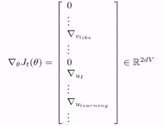
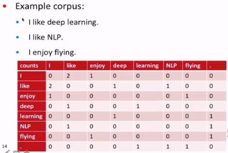
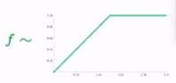

## Finish word2vec
### Stochastic gradients with word vectors
- But in each window, we only have at most $2m+1$ words, so $\nabla_{\theta}J_t(\theta)$ is very sparse!

  
- Most of the objective functions are mot convex,so initialization dose matter.

## Assignment 1:
### The skip gram model and negative sampling
- paper: "Distributed Representations of Words and Phrases and their Compositionality"
- Overall objective function: $J(\theta) =  \frac{1}{T}\displaystyle\sum_{t=1}^{T}J_t(\theta)$

$$J_t(\theta) = \log\sigma(u_o^Tv_c)+\sum_{j=1}^k{\Bbb{E}}_{j\sim P(w)}[\log\sigma(-u_j^Tv_c)]$$

- So we maximize the probability of two words co-occurring in first log
- Slightly clearer notation:
$$J_t(\theta) = \log\sigma(u_o^Tv_c)+\sum_{j=1}^k{\Bbb{E}}_{j\sim P(w)}[\log\sigma(-u_j^Tv_c)]$$
- We take k negative samples
- Maximize probability that real outside word appears, minimize prob. that random words appears around center word
- $\displaystyle P(w) = \frac{U(w)^{\frac{3}{4}}}{Z}$, the unigram distribution $U(w)$ raised to the $\displaystyle\frac{3}{4}$ power.
- The power makes less frequent words be sampled more often

### The continuous bag of words model
- Main idea: Predict center word from sum of surrounding word vectors

### Summary of Word2vec
- Go through each word of the whole corpus
- Predict surrounding words of each word
- Capture cooccurrence of words one at a time

### Window based co-occurrence matrix

- Solution: Low dimensional vectors
  - a dense vector
  - 25-1000 dimensions
  - reduce the dimensionality —— use the SVD

### Count based vs. direct predict
- Count based
  - relatively fast to train
  - make eficient usage of the statistics we have
  - collect the statistics once
  - captures mostly word similarity, not various other patterns that the word2vec model captures
  - often give disproportionate importance to these large counts

- Skip gram model
  - Generate improved performance on other tasks
  - Can capture complex patterns beyound word similarity
  - scales with a corpus size, go through every single window
  - Inefficient usage of the statistics

## GloVe: Combining the best of both worlds

$$\displaystyle J(\theta) = \frac{1}{2}\sum_{i,j=1}^Wf(P_{ij})(u_i^Tv_j-\log P_{ij})^2$$

- Fast training
- Scalable to huge corpora
- Good performance even with small corpus, and small vectors

### two sets of vectors
- end up with U and V from all the vectors u and v (in columns)
- best solution:
  $$X_{final} = U + V$$
  

- The skip-gram model tries to capyure co-occurrence one window at a time; And the GloVe model tries to capture the counts of the overall statistics of how often these words appear together.

## How to evaluate word vectors?
- Intrinstic
  - Evaluation on a specific/intermediate subtask
  - Fast to compute
  - Help to understand the system
  - Not clear if really helpful unless correlation to real task is established
  - $d = \displaystyle arg\ max\frac{(x_b-x_a+x_c)^Tx_i}{||x_b-x_a+x_c||}$
  
  - Correlation evaluation
- Extrinstic
  - Evaluation on a real task
  - Can take a long time to compute accuracy
  - Unclear if the subsystem is the problem or its interaction or other subsystems
  
  - If replacing exactly one subsystem with another improves accuracy $\rightarrow$ Winning!

## The softmax
$$\displaystyle p(y|x) = \frac{exp(W_y.x)}{\sum_{c=1}^{C}exp(W_c.x)}\ \ \ \ W\in{\Bbb{R}}^{C*d}
$$