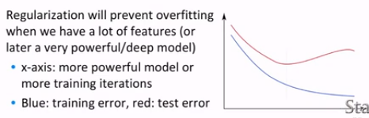
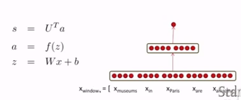
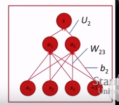

## Classification background
### setup and notation
- $\{x_i, y_i\}_{i=1}^N$

- $x_i$ inputs
- $y_i$ labels we try to predict
  - class: sentiment, name entities, buy/sell decision
  - other words
  - later: multi-word sequences

### Detail of softmax
- tease apart $\displaystyle p(y|x) = \frac{\exp(W_y.x)}{\sum_{c=1}^C\exp(W_c.x)}$ into two steps:
  
  - Take the y'th row of W :
  
    $\displaystyle W_y.x = \sum_{i=1}^dW_{yi}x_i = f_y$
  - $\displaystyle p(y|x) = \frac{\exp(f_y)}{\sum_{c=1}^C\exp (f_c)} = softmax(f)_y$

### Training with softmax and cross-entropy error
- To mininize: $-\log p(y|x)$
- Corss-entropy: $\displaystyle H(p,q) = -\sum_{c=1}^Cp(c)\log q(c)$
- loss function:
  
  $J(\theta) = \frac{1}{N}\displaystyle\sum_{i=1}^N-\log\left(\frac{\exp(f_{yi})}{\sum_{c=1}^C\exp (f_c)}\right)$

- write $f$ in matrix notation: $f = W_x$

### Regularization
$J(\theta) = \frac{1}{N}\displaystyle\sum_{i=1}^N-\log\left(\frac{\exp(f_{yi})}{\sum_{c=1}^C\exp (f_c)}\right)+\lambda\sum_k\theta_k^2$




## Updating word vectors for classification
- If you only have a small training dataset, don't train the word vectors

## Window classification & cross wntropy error derivation tips
- Idea: classify a word in its context window of neighbouring words
  
- Train softmax classifier by assigning a label to a center word and concatenating all word vectors surrounding it
  - Example: Classify Paris with window length 2:
    
    ... museums in Paris are amazing ... .

    $X_{window} = [\ \ x_{museums}\ \ x_{in}\ \ x_{Paris}\ \ x_{are}\ \ x_{amazing}\ ]^T$
    
    Resulting vector $x_{window} = x\in R^{5d}$, a column vector!

### Simplest windiw classifier: Softmax
- $x = x_{window}$
  
  $\displaystyle \hat{y}_y = p(y|x) = \frac{\exp(W_y.x)}{\sum_{c=1}^C\exp(W_c.x)}$

### Updating concatenated word vectors
- $\displaystyle\frac{\partial}{\partial x}-\log softmax(f_y(x)) = \sum_{c=1}^C-\frac{\partial \log softmax(f_y(x))}{\partial f_c}\frac{\partial f_c(x)}{\partial x}$
  
- First take the derivative wrt $f_c$ when c=y(correct class), then incorrect classes.
- $\displaystyle\frac{\partial}{\partial f}-\log softmax(f_y(x)) = [\hat{y}-t] = \delta$
- $\displaystyle\sum_{c=1}^C-\frac{\partial \log softmax(f_y(x))}{\partial f_c}\frac{\partial f_c(x)}{\partial x} = \sum_{c=1}^C\delta_cW_c^T.$
- $\displaystyle\frac{\partial}{\partial x}-\log p(y|x) = \sum_{c=1}^C\delta_cW_c^T. = W^T\delta$
- Let $\nabla_xJ = W^T\delta = \delta_{window}\in{\Bbb{R}}^{5d}$
```
from numpy import random
N = 500 # number of windows to be classified
d = 300 # dimensionality of each window
C = 5 # number of classes
W = random.rand(C,d)
wordvectors_list = [ramdom.rand(d,1) for i in range(N)]
wordvectors_one_matrix = random.rand(d,N)

%timeit [W.dot(wordvectors_list[i]) for i in range(N)]
%timeit W.dot(wordvectors_one_matrix)
```


## A single layer neural network
- A combination of linear layer and a nonlinearity:
  
  $z = Wx+b$

  $a = f(z)$
- The neural activations $a$ can be used to compute some output
- A probability via softmax: $p(y|x) = softmax(Wa)$
- Or an unnormalized score: $score(x) = U^Ta\in\Bbb{R}$


$s = U^Tf(Wx+b)\ \ \ \ x\in\Bbb{R}^{20*1},\ W\in\Bbb{R}^{8*20}, U\in\Bbb{R}^{8*1}$


## Max-Margin loss and backprop
### The max-margin loss
- $s = score(meseums in Paris are amazing)$
- $s_c = score(Not all museums in Paris)$
- Idea for training objective: make score of true window larger and corrupt window'sscore lower(until they're good enough): minimize

  $J = max(0,1-s+s_c)$

- powerful and useful

### Training with Backpropagation
- $J = max(0,1-s+s_c)$
  - $s = U^Tf(Wx+b)$
  - $s_c = U^Tf(Wx_c+b)$

1. $\displaystyle\frac{\partial s}{\partial U} = \frac{\partial}{\partial U}U^Ta = a$
   
2. $\displaystyle\frac{\partial s}{\partial W} = \frac{\partial}{\partial W}U^Ta = \frac{\partial}{\partial W}U^Tf(z) = \frac{\partial}{\partial W}U^Tf(Wx+b)$

    $\displaystyle \frac{\partial}{\partial W_{ij}}U^Ta\rightarrow \frac{\partial}{\partial W_{ij}}U_i^Ta_i$

    $\displaystyle U_i\frac{\partial}{\partial W_{ij}}a_i = U_i\frac{\partial a_i}{\partial z_i}\frac{\partial z_i}{\partial W_{ij}} = U_i\frac{\partial f(z_i)}{\partial z_i}\frac{\partial z_i}{\partial W_{ij}} = U_if'(z_i)\frac{\partial z_i}{\partial W_{ij}}$
   
    $\displaystyle U_i\frac{\partial}{\partial W_{ij}}a_i = U_if'(z_i)\frac{\partial W_ix+b_i}{\partial W_{ij}} = U_if'(z_i)\frac{\partial}{\partial W_{ij}}\sum_kW_{ik}x_k = U_if'(z_i)x_j = \delta_ix_j$

    where $f'(z) = f(z)(1-f(z))$ for logistic f.

    $i = 1,2\ and\ j = 1,2,3\ \displaystyle\Rightarrow \frac{\partial s}{\partial W} = \delta x^T$

    where $\delta\in\Bbb{R}^{2*1}$ is the "responsibility" or error signal fron each activation $a$.
    
    $$
     \left[
     \begin{matrix}
      x_1 \\ x_2 \\ x_3 \\ 1
     \end{matrix}
     \right] \tag{input}
    $$
    $$
      \left[
      \begin{matrix}
       W_{11} & W_{12} & W_{13}  \\
       W_{21} & W_{22} & W_{23}  
      \end{matrix}
      \right] \tag{W}
    $$

    $$
     \left[
     \begin{matrix}
       a_1 \\ a_2
      \end{matrix}
      \right] \tag{a}
    $$

    

3. $\displaystyle U_i\frac{\partial}{\partial b_i}a_i = \displaystyle U_if'(z_i)\frac{\partial (W_i.x+b_i)}{\partial b_i} = \delta_i$

4. $\displaystyle\frac{\partial s}{\partial x_j} = \sum_{i=1}^2\frac{\partial s}{\partial a_i}\frac{\partial a_i}{\partial x_j} = \sum_{i=1}^2\frac{\partial U^Ta}{\partial a_i}\frac{\partial a_i}{\partial x_j} = \sum_{i=1}^2U_i\frac{\partial f(W_i.x+b)}{\partial x_j} = \sum_{i=1}^2U_if'(W_i.x+b)\frac{\partial W_i.x}{\partial x_j} = \sum_{i=1}^2\delta_i W_{ij} = W_{.j}^T\delta$

    $\displaystyle\Rightarrow \frac{\partial s}{\partial x} = W^T\delta$

### Just chain rule, chain rule, chain rule!
### Just reuse derivative, reuse derivative, reuse derivative!

- The error message $\delta$ that arrives at a hidden layer has the same dimensionality as that hidden layer.

- $J = max(0,1-s+s_c)$
  - $s = U^Tf(Wx+b)$
  - $s_c = U^Tf(Wx_c+b)$
  - $\displaystyle\frac{\partial J}{\partial U} = 1\{1-s+s_c>0\}(-f(Wx+b)+f(Wx_c+b))$
  - $\displaystyle\frac{\partial J}{\partial U} = 1\{1-s+s_c>0\}(-a+a_c)$