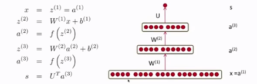
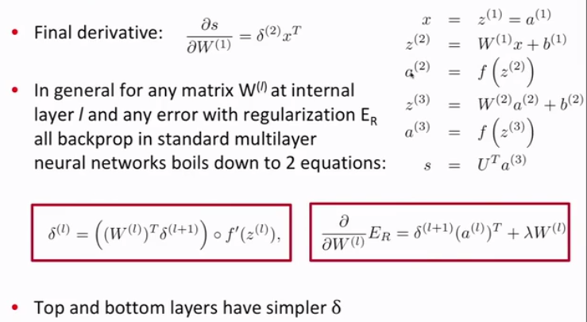
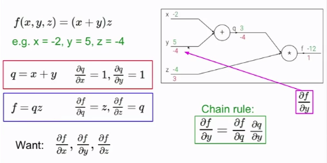
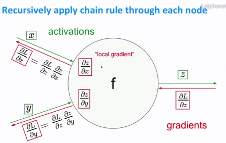
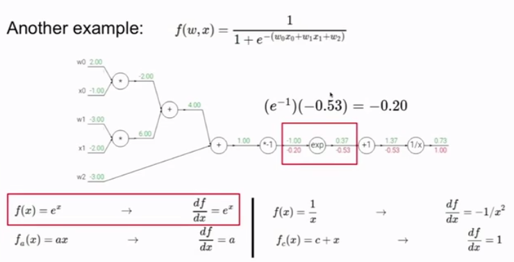
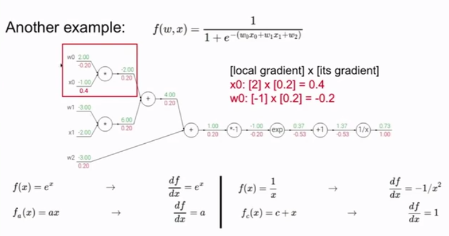
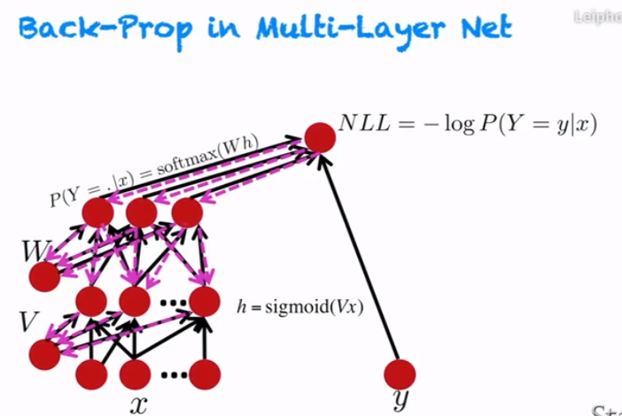
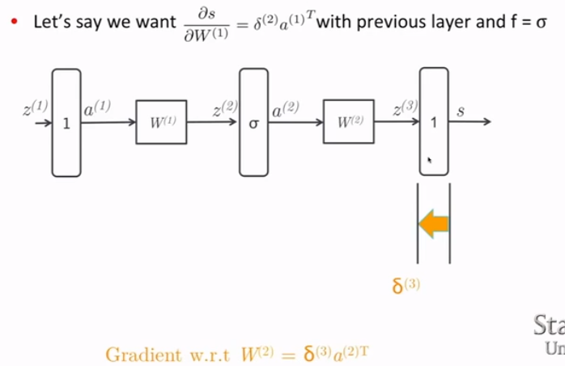
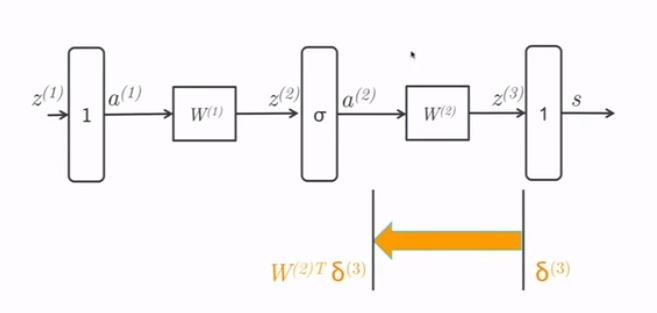
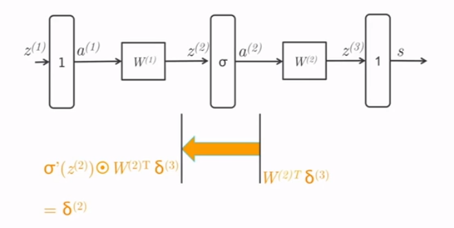

# Back Propagation

## From one-layer to multi layer neural networks
### Two layer neural nets and full backprop

- 要最大化最后的score值

### Backprop
$$
\begin{aligned}
s &= U^Tf(W^{(2)}f(W^{(1)}x+b^{(1)})+b^{(2)})\\
& = U^Tf(W^{(2)}a^{(2)}+b^{(2)})\\
& = U^Ta^{(3)}\\
\frac{\partial s}{\partial W_{ij}}& = U_if'(z_i)x_j\\
&=\delta_i x_j\\
\frac{\partial s}{\partial W_{ij}^{(2)}}& = U_if'(z_i^{(3)})a_j^{(2)}\\
&=\delta_i^{(3)} a_j^{(2)}\\
In\ matrix\ notation:\\ \frac{\partial s}{\partial W^{(2)}} &= \delta^{(3)} a^{(2)T}\\
where\ \ \delta^{(3)} &= U\bigotimes f'(z^{(3)})\ \ (element-wise \ \ product)
\end{aligned}
$$

## 4 descriptions and viewpoints of backprop
### Functions as circuits
- 局部误差，全局误差
- 局部梯度，全局梯度
- Chain Rule
- 对于每一个节点，都要计算它的局部梯度，然后乘上上面传下来的梯度信号

- $\displaystyle\frac{d\sigma(x)}{dx} = \frac{e^{-x}}{(1+e^{-x})^2} = \left(\frac{1+e^{-x}-1}{1+e^{-x}}\right)\left(\frac{1}{1+e^{-x}}\right) = (1-\sigma(x))\sigma(x)$

  
  

### The high-level flowgraph
- Flow graph: any directed acyclic graph
  - node = conputation result
  - arc = conputation dependency
  
- $\{y_1, y_2, ...\ y_n\} = seccessors\ of\ x$
- $\displaystyle\frac{\partial z}{\partial x} = \sum_{i=1}^n\frac{\partial z}{\partial y_i}\frac{\partial y_i}{\partial x}$
  
  

### The actual error signals in neural nets
- 
- 
- reusing the $\delta^{(3)}$ for downstream updates
- Moving error vector across affine transformation simply requires multiplication with the transpose of forward matrix
- Notice that the dimensions will line up perfectly too.
  
- Moving error vector across point-wise non-linearity repuires point-wise multiplication with local gradient of the non-linearity

### Problems
1. 这个score到底是啥
2. 是根据什么确定最终分类结果的
3. 第四讲前半部分的矩阵维度
4. 有一个偏导搞不懂